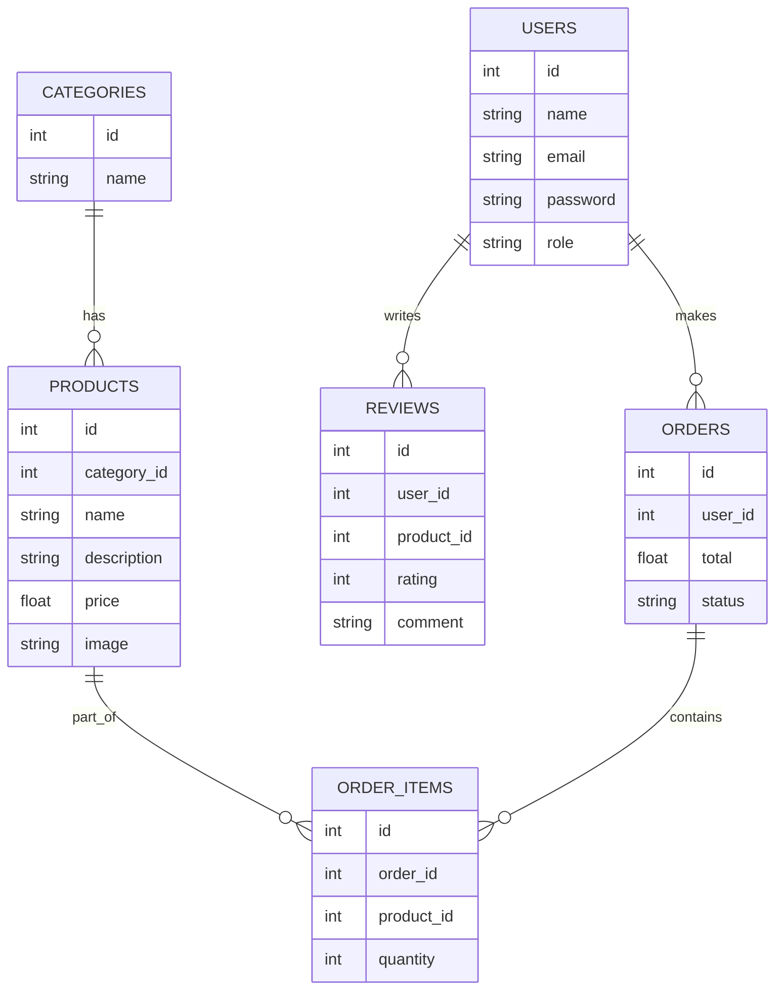

```mermaid
erDiagram
    USERS ||--o{ ORDERS : makes
    USERS ||--o{ REVIEWS : writes
    CATEGORIES ||--o{ PRODUCTS : has
    PRODUCTS ||--o{ ORDER_ITEMS : part_of
    ORDERS ||--o{ ORDER_ITEMS : contains

    USERS {
      int id
      string name
      string email
      string password
      string role
    }
    CATEGORIES {
      int id
      string name
    }
    PRODUCTS {
      int id
      int category_id
      string name
      string description
      float price
      string image
    }
    ORDERS {
      int id
      int user_id
      float total
      string status
    }
    ORDER_ITEMS {
      int id
      int order_id
      int product_id
      int quantity
    }
    REVIEWS {
      int id
      int user_id
      int product_id
      int rating
      string comment
    }
```
